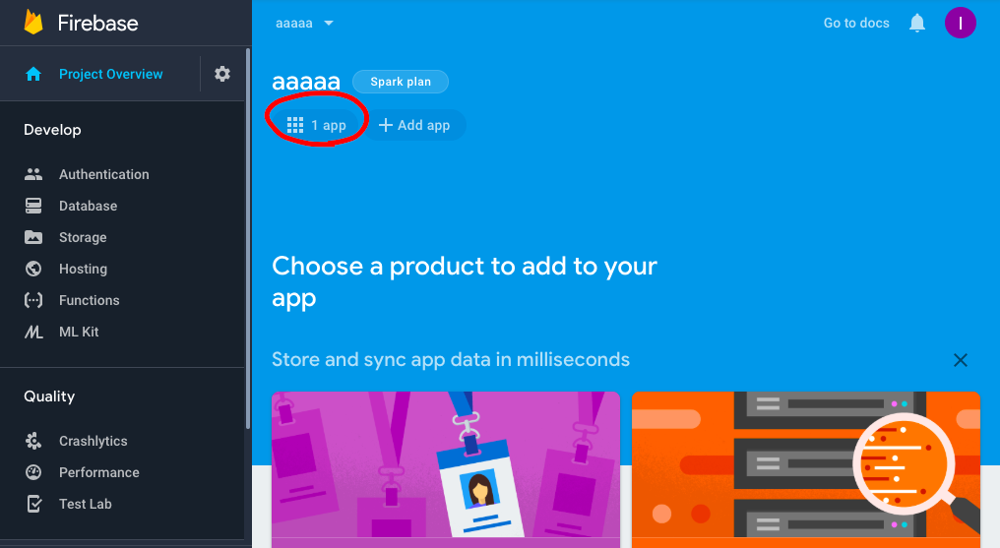
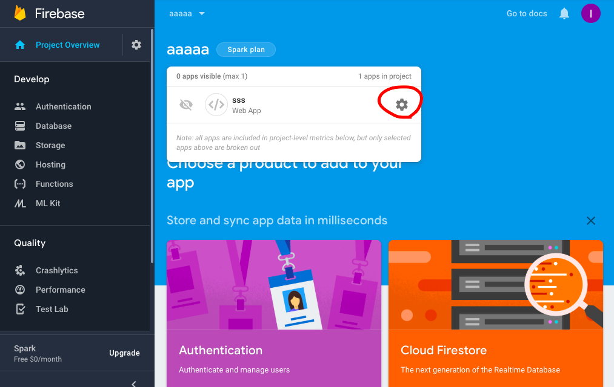
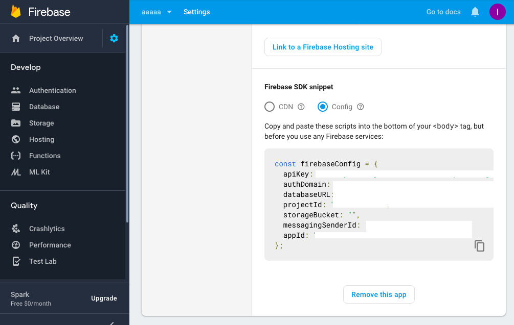
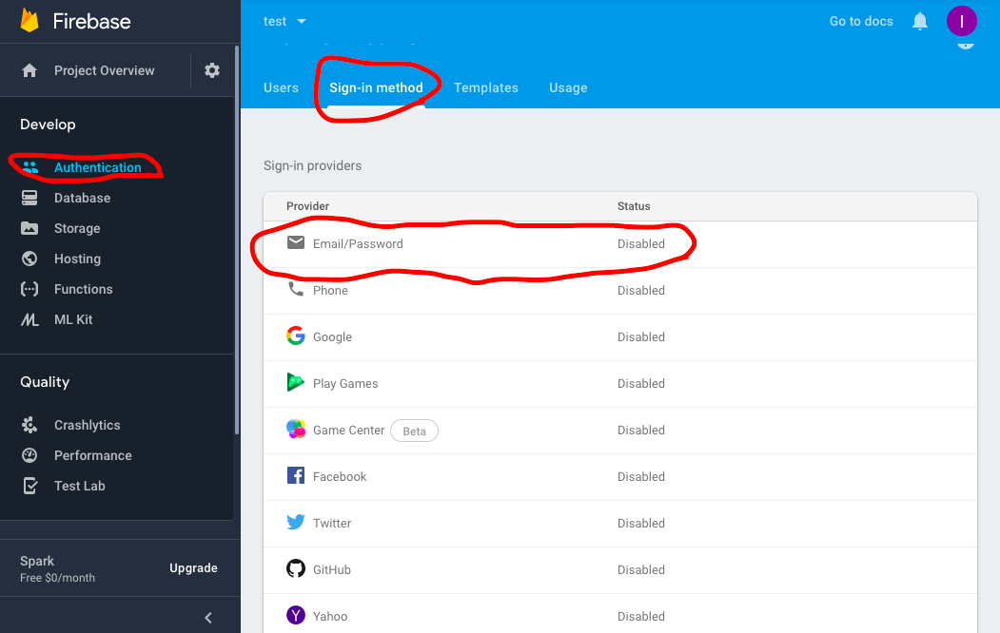
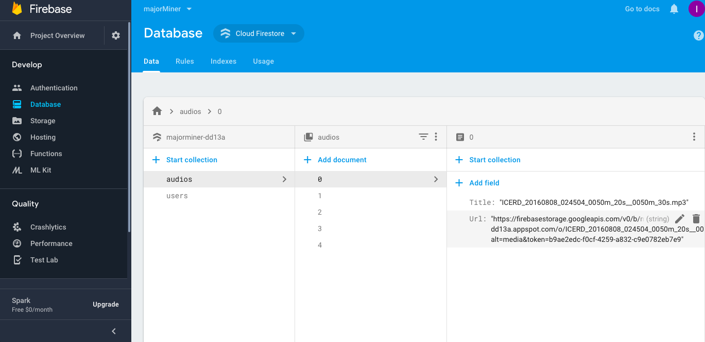

# Major Miner in React

## Setup instructions:
1. Clone this repository
2. Install necessary packages
```bash
npm install
```
## Connect Major Miner to your firebase

1. Create a new project in your firebase.
- Click **Add project** to add a new project.
- Enter your project name then click **continue** to finish creating the project.

2. Register your app
- In the Firebase console’s project overview page, click the web **(<>)** to launch the setup workflow.
- Enter your app’s nickname, register your app.
- You will need the Firebase SDK later, for now, click **Continue to console**

*Because the .gitignore file is ignoring .env file for security access reason so you have to generate .env your own.*

3. Create `.env` file inside project root directory to include firebase project credentials
```
REACT_APP_FIREBASE_KEY=
REACT_APP_FIREBASE_DOMAIN=
REACT_APP_FIREBASE_DATABASE=
REACT_APP_FIREBASE_PROJECT_ID=
REACT_APP_FIREBASE_STORAGE_BUCKET=
REACT_APP_FIREBASE_SENDER_ID=
```
You can access firebase SDK by going to **Project Overview**
.Click **1 app**:

.Click setting icon:


.Under **General** page, you will see the SDK values.


## Firebase set up

1. Enable the **Email/Password** sign-in method under **Authentication**:


2. Create database
- **Start in locked mode** finish creating **Cloud Firestore**
- Modify **Rules** to allow read and write:
```
service cloud.firestore {
    match /databases/{database}/documents {
        match /{document=**} {
            allow read, write: if request.auth.uid != null;
        }
    }
}
```
3. Upload audio clips into firebase storage, then make sure the **Rules**
```
rules_version = '2';
service firebase.storage {
    match /b/{bucket}/o {
        match /{allPaths=**} {
            allow read, write: if true;
        }
    }
}
```
4. Adding collections and copy the **Url** from each clip files under firebase storage:


5. Run
```bash
 gsutil cors set cors.json gs://<your-cloud-storage-bucket>
```
to successfully load the clips from firebase storage.
**Hint:**
If you have not download gcloud yet, you will get a error message
**Download gcloud:**
```bash
curl https://sdk.cloud.google.com | bash
```
```bash
exec -l $SHELL
```
```bash
gcloud init
```
## Other setup
- [CORS configuration](https://firebase.google.com/docs/storage/web/download-files#cors_configuration) (For access to Firebase data)
