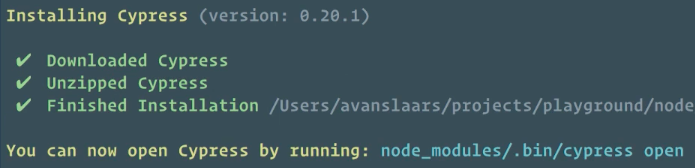

# Cypress-Firebase

## Setup instructions:
(This instruction is based one someone already has a Firebase project and trying to install Cypress on testing Firebase)
Make sure install npm and Node.js first: [To Download](https://docs.npmjs.com/downloading-and-installing-node-js-and-npm)
---- Personally recommand using **nvm** to download Node version managers to install Node.js and npm if you are using **mac**
[Using nvm](https://github.com/nvm-sh/nvm)

1. Go to project setting on firebase console and generate new private key. See how to do [here](https://sites.google.com/site/scriptsexamples/new-connectors-to-google-services/firebase/tutorials/authenticate-with-a-service-account)
2. Save the downloaded file as serviceAccount.json in the root of your project (for local dev)
3. install Cypress
```bash
npm i --save-dev cypress
```
4. Add cypress folder by ```bash cypress open ``` (No EVERY case!)
**Note:** You would get instruction on how to run cypress from the command window after you successfuly installed it.


So in this case: ```bash node_modules/.bin/cypress open```

5. install firebase-tools
```bash npm install firebase-tools@^7 ``` (You have to install peer dependencies yourself!)
To make sure you can succefully using firbase CLI:
```bash firebase --version```
If it gave you Error message like:
```bash
SyntaxError: Unexpected token ...
....
....
```
Looks like:

It's because you might have different version of Node.js and npm! You might need to go back to install Node version managers again, to check the version of your Node.js and npm:
```bash
node -v
npm -v
```
6. If you successfully install firebase CLI, install cypress-firebase by callling:
```bash
npm i cypress-firebase --save-dev
```
7. Modify your **package.json**,  **cypress/config.json**(You might need to manually create it),  **cypress/support/commands.js** , **cypress/plugins/index.js** files.
    see [details](https://github.com/prescottprue/cypress-firebase#folders)
And compelete the instruction from the Link.
## Error and Solved
1. After set up all the files and plug in, **Error: .firebaserc file not found**, you have to run ```bash firebase init```
[see instruction](https://firebase.google.com/docs/cli)
If you don't know how to set up your project after ```bash firebase init ```,
[see article](https://medium.com/google-developer-experts/deploy-your-app-to-firebase-in-seconds-b3a9a37dff47)

2. Error for firebase functions: run ```bash npm install ``` **INSIDE** your **functions** folder.
3. If you getting blank page inside Cypress after ```bash npm run start:dist```, open your **firebase.json** file, make sure under **"hosting"** section:
```**"public": "build",**```

## **WARNING!:** Don't push your **serviceAccount.json** (and any files contains your private keys) into public resources! 
