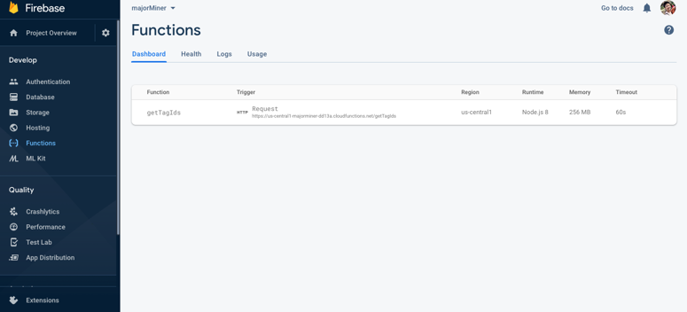
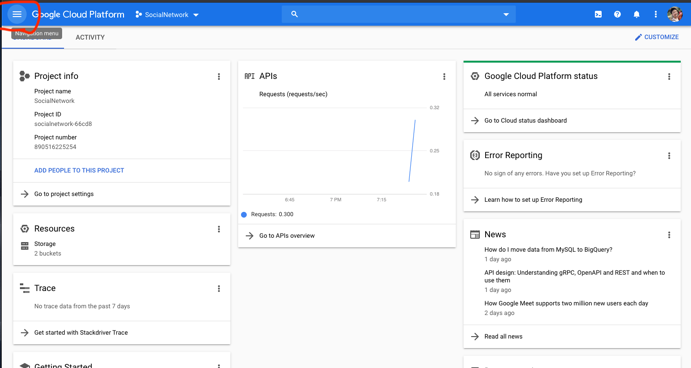
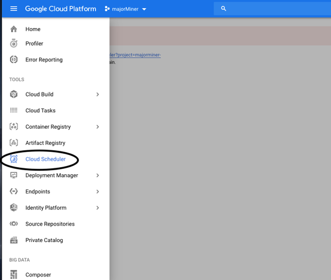
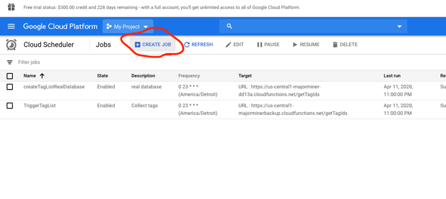
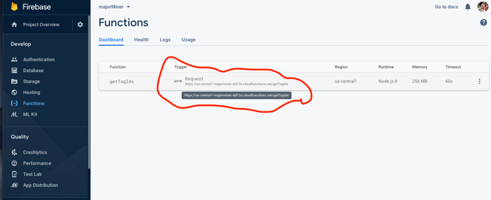
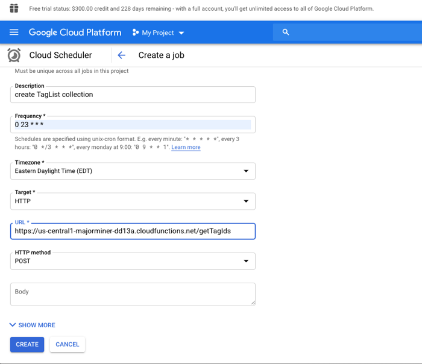
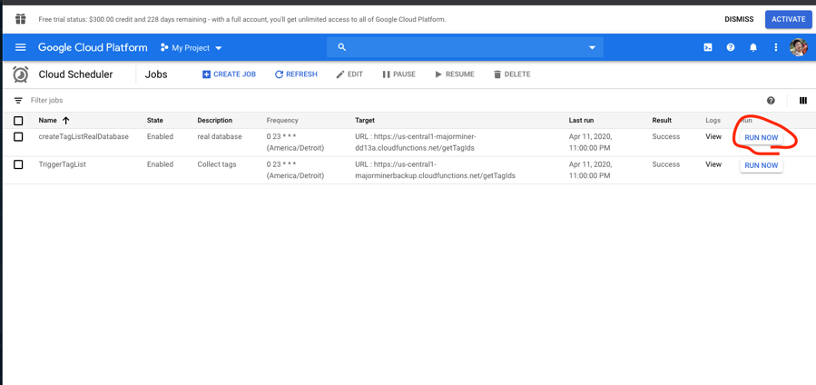
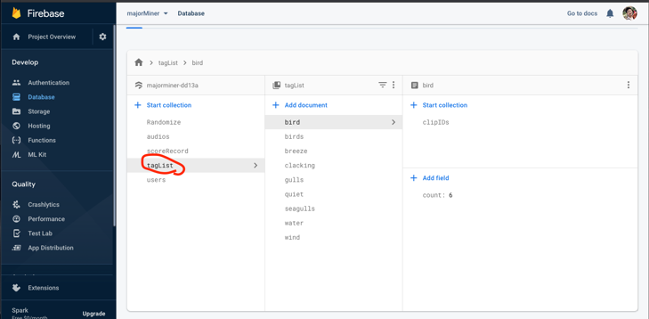

# Firebase Cloud Functions

## Setup Firebase command line tools and Cloud functions:
1. [Followed the tutorial](https://www.youtube.com/watch?v=DYfP-UIKxH0)
(**Attention**: Please make sure your choose TypeScript as your language for your cloud functions)

2. After successfully set up the firebase cloud functions (make sure you are able to compile the “helloWorld” function from the tutorial). You can copy the index.ts file from [https://github.com/majorminergame/majorminergame.github.io/blob/temp/functions/src/index.ts](https://github.com/majorminergame/majorminergame.github.io/blob/temp/functions/src/index.ts) into your {rootDirectory}/functions/src folder.

**Hint**: Remember when you test and run your functions as well as deploy it, make sure you are in your **functions** directory

3. Deploy your cloud functions: 
```bash
 firebase deploy
```
    
4. If everything works expectedly, you are able to see the **getTagIds** function is successfully deployed into your Firebase


## Schedule your cloud function from Google Cloud Platform:

1. Google **Google Cloud Platform**. Login to your account and go to **console**

2. 

3. 

4. 

5. Copy your cloud function URL from you Firebase:

into your Google Clound Function Scheduler:


6. Set up the scheduler as above picture and hit **CREATE**

7. You are able to see your scheduled function is listed in the job list! The function is scheduled to run every day at 11:00 pm. But just to confirm if everything is going to run as expectedly, hit “RUN NOW” to run the function. 


8. Go to your Firebase database, if you are able to see “tagList” collection is created, then congratulations! You have successfully created and scheduled the cloud function!

